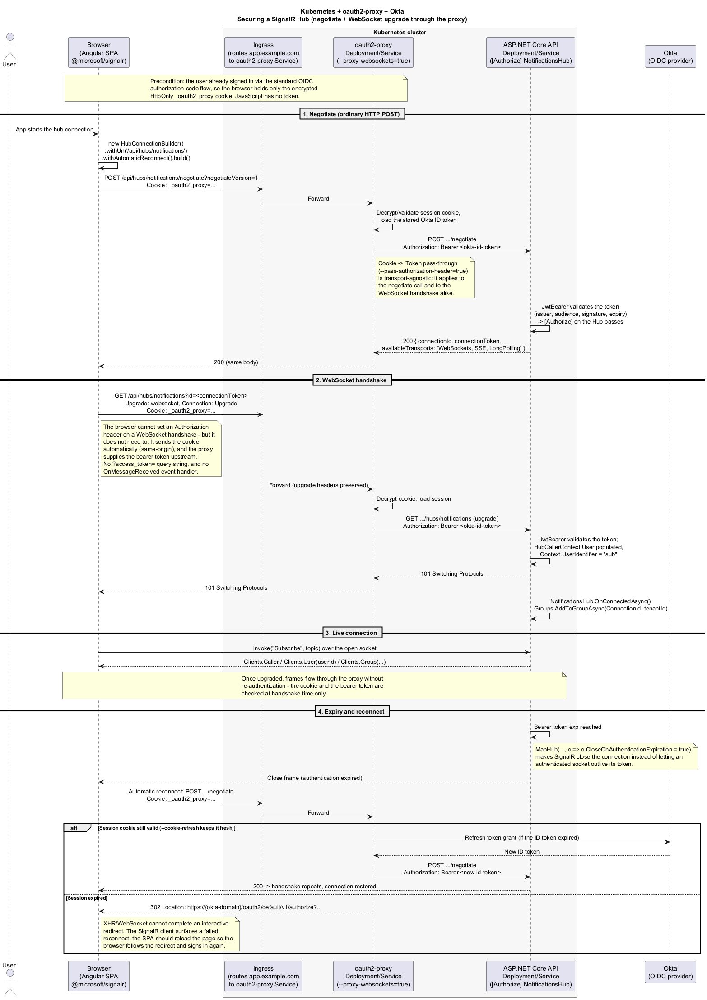

# Auth Pattern: oauth2-proxy + Okta with an Angular SPA and ASP.NET Core API

This document describes an authentication pattern in which an Angular single-page
application and an ASP.NET Core API run in **Kubernetes** behind
[oauth2-proxy](https://oauth2-proxy.github.io/oauth2-proxy/), with **Okta** as the OIDC
identity provider. Every building block is stock: a standard Kubernetes Ingress, a
standard oauth2-proxy deployment in reverse-proxy (upstream) mode, and Okta's standard
authorization-code flow — nothing is custom to this implementation.

The defining properties of the pattern:

- **The browser holds only a session cookie.** No access token, ID token, or refresh
  token is ever stored in — or visible to — JavaScript.
- **Proxy Pass-Through ("Cookie → Token").** On every proxied request, oauth2-proxy
  exchanges its session cookie for the Okta ID token and forwards it to the upstream
  API as a standard `Authorization: Bearer` header.
- **The SPA gets the current userId without a backend API.** The Angular app fetches a
  static `.txt` file through the proxy and reads identity response headers that
  oauth2-proxy attaches. No .NET endpoint is required for this.
- **Real-time works the same way.** A SignalR hub is secured by the same exchange: the
  cookie rides along on the WebSocket handshake and the proxy turns it into a bearer
  token, so no `?access_token=` query-string workaround is needed.

## Actors

| Actor | Role |
|---|---|
| Browser (Angular SPA) | Sends the session cookie on every request; never handles tokens |
| Kubernetes Ingress | Routes all `app.example.com` traffic to the oauth2-proxy Service |
| oauth2-proxy (Deployment/Service) | Terminates authentication; owns the cookie ↔ token exchange |
| Okta | OIDC provider; runs the login flow and issues the ID token with the user's claims |
| ASP.NET Core API (Deployment/Service) | Upstream; validates the Bearer token it receives from the proxy, including on SignalR hub connections |
| Angular assets (nginx Deployment/Service) | Serves the built Angular app, including a static `whoami.txt` used for identity discovery |

## Architecture


*Source: [`architecture.puml`](./architecture.puml)*

Everything the browser talks to enters through the Ingress, which routes all traffic
for the host to the oauth2-proxy Service. oauth2-proxy runs in its standard
reverse-proxy (upstream) mode, forwarding to the Angular assets Service and the
ASP.NET Core API Service. Okta is only involved during login and token refresh — it
never sees the day-to-day traffic.

## Login and cookie flow

An unauthenticated request to any path triggers the standard OIDC authorization-code
flow: the Ingress forwards the request to oauth2-proxy, which redirects the browser to
Okta to sign in. Once the flow completes, oauth2-proxy stores the session (including
the Okta ID token) encrypted, and the browser carries only the encrypted
`_oauth2_proxy` cookie from then on.


*Source: [`login-flow.puml`](./login-flow.puml)*

The cookie is `HttpOnly`, so it is invisible to the Angular application. From the SPA's
point of view, authentication simply "already happened" by the time it renders.

## Proxy Pass-Through: Cookie → Token

The API expects a normal JWT Bearer token, but the browser only has a cookie. The
bridge is oauth2-proxy's authorization-header configuration:

```
--pass-authorization-header=true
--set-authorization-header=true
```

- **`--pass-authorization-header=true`** — for every authenticated proxied request,
  oauth2-proxy looks up the session behind the cookie and injects
  `Authorization: Bearer <okta-id-token>` into the request it forwards to the upstream.
  This is the "Cookie → Token" exchange: the browser sends a cookie, the API receives a
  token.
- **`--set-authorization-header=true`** — additionally sets the `Authorization` header
  on the *response*. This matters in `auth_request`-style deployments (e.g. behind
  nginx), where the fronting server reads the header from oauth2-proxy's response and
  attaches it to the upstream request itself.

On the .NET side, nothing about this pattern is custom: the API validates the incoming
token as an ordinary JWT with `AddJwtBearer`, using the Okta authority
(`https://{okta-domain}/oauth2/default`) so signing keys and issuer validation come
from Okta's OIDC discovery document. The API does not need to know oauth2-proxy exists.

## Getting the userId in Angular — the static-file trick

The SPA often needs to know *who* is logged in (to show a name, key client-side state
by user, etc.). Because the cookie is opaque to JavaScript, the app can't decode
anything locally — and this pattern deliberately avoids adding a .NET endpoint for it.

Instead, one more oauth2-proxy flag is enabled:

```
--set-xauthrequest=true
```

With this flag, oauth2-proxy attaches identity **response headers** to the responses it
proxies:

| Response header | Populated from |
|---|---|
| `X-Auth-Request-User` | The user identifier from the session (by default the ID token's `sub`; with `--prefer-email-to-user=true`, the email) |
| `X-Auth-Request-Email` | The `email` claim |
| `X-Auth-Request-Preferred-Username` | The `preferred_username` claim |

Okta supplies these values as claims in the ID token during login; oauth2-proxy stores
them in the session and surfaces them as headers. The trick is that the headers appear
on *any* proxied response — so the cheapest possible request works: a static text file.

1. Ship an empty (or one-line) file with the Angular build, e.g.
   `src/assets/whoami.txt`, served by the Angular assets nginx pod.
2. At startup, the Angular app fetches it through the Ingress and oauth2-proxy and
   reads the header instead of the body.


*Source: [`userid-via-whoami-headers.puml`](./userid-via-whoami-headers.puml)*

```typescript
// identity.service.ts
import { HttpClient } from '@angular/common/http';
import { Injectable } from '@angular/core';
import { map, shareReplay } from 'rxjs/operators';
import { Observable } from 'rxjs';

@Injectable({ providedIn: 'root' })
export class IdentityService {
  readonly userId$: Observable<string | null>;

  constructor(http: HttpClient) {
    this.userId$ = http
      .get('/assets/whoami.txt', { observe: 'response', responseType: 'text' })
      .pipe(
        map(res => res.headers.get('X-Auth-Request-User')),
        shareReplay(1)
      );
  }
}
```

Because the request is **same-origin** (it goes to the same host the app was served
from, through the proxy), the browser lets JavaScript read all response headers — no
CORS or `Access-Control-Expose-Headers` configuration is needed.

**Caching caveat:** the headers come from the proxy, not the file. If the browser or a
CDN serves `whoami.txt` from cache, the request never reaches oauth2-proxy and the
headers will be missing or stale. Serve the file with `Cache-Control: no-store`, or
append a cache-busting query parameter (`/assets/whoami.txt?t=...`) when fetching it.

## Alternative: `GET /oauth2/userinfo`

oauth2-proxy also exposes a built-in endpoint, `GET /oauth2/userinfo`, which returns
the same identity information as JSON:

```json
{ "user": "00u1abcd...", "email": "jane@example.com", "preferredUsername": "jane" }
```

It uses the same session cookie and also requires no backend code. It is arguably more
conventional (a JSON body instead of headers on a static file) and immune to the
static-file caching caveat. This document standardizes on the static-file + response
header approach as the primary pattern, but `/oauth2/userinfo` is a drop-in alternative
if a JSON payload is preferred.

## Securing a SignalR Hub

Real-time features fit this pattern with no extra authentication machinery. The usual
pain point of securing a SignalR hub with JWTs — the browser's WebSocket API cannot set
an `Authorization` header, forcing the `?access_token=` query-string workaround and a
`JwtBearerEvents.OnMessageReceived` handler on the server — simply does not arise here.
The browser attaches the session cookie to the WebSocket handshake automatically because
it is a same-origin request, and oauth2-proxy performs the same Cookie → Token exchange
on that handshake that it performs on any other proxied request.

A SignalR connection is established in two steps, and both go through the proxy:

1. **Negotiate** — an ordinary `POST /api/hubs/notifications/negotiate`. The proxy
   injects `Authorization: Bearer <okta-id-token>`; the API returns the connection id and
   the available transports.
2. **WebSocket upgrade** — `GET /api/hubs/notifications?id=...` with `Upgrade: websocket`.
   oauth2-proxy proxies WebSockets by default (`--proxy-websockets=true`), preserving the
   upgrade headers and injecting the same bearer token before the request reaches the API.



*Source: [`signalr-hub-flow.puml`](./signalr-hub-flow.puml)*

### Server side

The hub is a plain `[Authorize]` hub validated by the same `AddJwtBearer` configuration
the rest of the API uses. There is nothing oauth2-proxy-specific in it:

```csharp
// Program.cs
builder.Services.AddSignalR();

app.MapHub<NotificationsHub>("/api/hubs/notifications", options =>
{
    // .NET 7+: close the connection when the bearer token expires instead of
    // letting an authenticated socket outlive the token that authorized it.
    options.CloseOnAuthenticationExpiration = true;
});
```

```csharp
[Authorize]
public class NotificationsHub : Hub
{
    public override async Task OnConnectedAsync()
    {
        // Same claims the API sees on any request - they come from the Okta ID token.
        var userId = Context.UserIdentifier;                  // "sub" by default
        var email  = Context.User?.FindFirst("email")?.Value;

        await Groups.AddToGroupAsync(Context.ConnectionId, $"user:{userId}");
        await base.OnConnectedAsync();
    }
}
```

`Context.UserIdentifier` comes from SignalR's default `IUserIdProvider`, which reads
`ClaimTypes.NameIdentifier` — the claim `JwtBearer` maps `sub` onto. If the API sets
`options.MapInboundClaims = false` (keeping raw claim names), supply a custom
`IUserIdProvider` that reads `"sub"` directly, otherwise `Clients.User(userId)` silently
addresses nobody. Using the same identifier the SPA reads from `X-Auth-Request-User`
keeps client and server talking about the same user.

### Client side

The Angular client is the default configuration — no accessTokenFactory, no headers:

```typescript
// notifications.service.ts
import { Injectable } from '@angular/core';
import { HubConnection, HubConnectionBuilder } from '@microsoft/signalr';

@Injectable({ providedIn: 'root' })
export class NotificationsService {
  private readonly connection: HubConnection = new HubConnectionBuilder()
    .withUrl('/api/hubs/notifications')   // same origin -> cookie is sent automatically
    .withAutomaticReconnect()
    .build();

  start(): Promise<void> {
    this.connection.on('notify', payload => { /* ... */ });
    return this.connection.start();
  }
}
```

The URL must be **relative** (same origin as the SPA) so the request flows through the
Ingress and the proxy and the cookie is attached. Do **not** set `skipNegotiation: true`:
skipping negotiate forces the WebSocket transport and removes the HTTP request that makes
proxy behaviour easiest to reason about, and it breaks sticky-session routing when the API
is scaled to more than one pod.

### Deployment details that matter

- **WebSocket support in the Ingress.** oauth2-proxy handles upgrades itself, but the
  Ingress controller must not close idle connections. With ingress-nginx:

  ```yaml
  metadata:
    annotations:
      nginx.ingress.kubernetes.io/proxy-read-timeout: "3600"
      nginx.ingress.kubernetes.io/proxy-send-timeout: "3600"
  ```

- **Token lifetime vs. connection lifetime.** Authentication is checked at handshake
  time only; once upgraded, frames are not re-authenticated. With
  `CloseOnAuthenticationExpiration = true` the server closes the socket when the bearer
  token expires, and `.withAutomaticReconnect()` re-runs negotiate — which gives
  oauth2-proxy the chance to refresh the token. Keep `--cookie-refresh` shorter than the
  Okta ID-token lifetime so the session is renewed before it lapses.
- **Reconnect after the session itself expires.** If the oauth2-proxy session is gone,
  negotiate is answered with a `302` to Okta. An XHR or WebSocket cannot complete an
  interactive redirect, so the reconnect fails. Handle
  `connection.onclose(...)` by reloading the page (`window.location.reload()`), which
  lets the browser follow the redirect and sign in again.
- **Scale-out.** More than one API pod requires the usual SignalR arrangements — a Redis
  backplane and sticky sessions (`nginx.ingress.kubernetes.io/affinity: cookie`) — since
  negotiate and the subsequent upgrade must reach the same pod.

## Full example configuration

A consolidated oauth2-proxy configuration for this pattern with Okta:

```
oauth2-proxy
  --provider=oidc
  --provider-display-name="Okta"
  --oidc-issuer-url=https://{okta-domain}/oauth2/default
  --client-id={okta-client-id}
  --client-secret={okta-client-secret}
  --redirect-url=https://app.example.com/oauth2/callback
  --email-domain=*

  # Cookie (what the browser holds)
  --cookie-secret={32-byte-random-secret}
  --cookie-secure=true
  --cookie-httponly=true

  # Cookie -> Token pass-through
  --pass-authorization-header=true
  --set-authorization-header=true

  # Identity response headers for the SPA
  --set-xauthrequest=true

  # WebSocket upgrades (SignalR) - enabled by default, shown for clarity
  --proxy-websockets=true

  # Upstreams (in-cluster Service DNS names)
  --upstream=http://api.default.svc.cluster.local/api/            # ASP.NET Core API Service
  --upstream=http://angular-assets.default.svc.cluster.local/     # Angular assets nginx Service
  --http-address=0.0.0.0:4180
```

In Kubernetes, oauth2-proxy runs as an ordinary Deployment with a Service, and a
standard Ingress routes all traffic for the host to that Service:

```yaml
apiVersion: networking.k8s.io/v1
kind: Ingress
metadata:
  name: app
spec:
  rules:
    - host: app.example.com
      http:
        paths:
          - path: /
            pathType: Prefix
            backend:
              service:
                name: oauth2-proxy
                port:
                  number: 4180
```

In Okta, this corresponds to a standard **Web** application (authorization-code grant)
whose sign-in redirect URI is `https://app.example.com/oauth2/callback`. The `sub`,
`email`, and `preferred_username` claims in the ID token are what populate the
`X-Auth-Request-*` headers above.

## Security notes

- **No tokens in the browser.** The session cookie is `HttpOnly` and `Secure`; XSS in
  the SPA cannot exfiltrate a token, because JavaScript never has one.
- **The headers are self-disclosure only.** `X-Auth-Request-*` headers reveal the
  requesting user's own identity to their own browser — nothing about other users.
- **The API must still validate the JWT.** The proxy is not a trust boundary the API
  should blindly rely on. `AddJwtBearer` validation (issuer, audience, signature,
  expiry against the Okta authority) must remain enabled, and the API should not be
  reachable except through the proxy.
- **A WebSocket is authenticated once.** Unlike request/response traffic, an upgraded
  SignalR connection is not re-checked per frame, so a revoked or expired session can
  outlive its socket. `CloseOnAuthenticationExpiration = true` bounds that window to the
  token's lifetime; hubs that must react to revocation faster need an explicit
  server-side disconnect.
- **Strip inbound identity headers.** If the deployment ever honors `X-Auth-Request-*`
  or `Authorization` from clients directly (bypassing the proxy), a client could forge
  them. Network topology should guarantee that all API traffic flows through
  oauth2-proxy.
